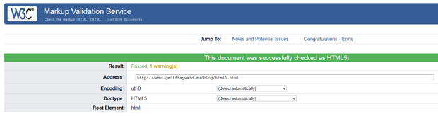

You can get the Open Graph metadata properties used by Facebook to validate. It's easy and it does not require any hacks. Read this if you need to get your Open Graph metadata to validate.

<!--more-->



## First Step to Validating Open Graph: HTML5

Your first step to getting Open Graph to validate is to check that your HTML is using a HTML5 doctype. The Open Graph metadata properties used by Facebook are designed to be used with HTML5.

If you are uncertain about the doctype you are using, you can get the W3C's [Markup Validation Service](https://validator.w3.org/) to tell you.

## Second step to Validating Open Graph: OG namespace

Your second step to getting Open Graph to validate is to get the OG namespace in scope. The OG namespace is what you see prefixed to the value of each of the property attributes of each of the Open Graph meta elements, such as: `og:title`, `og:image`, and so on.

You import the Open Graph schema and create the OG namespace using the HTML5 native attribute named 'prefix'. The import instruction of the Open Graph schema can be added to the HTML element named `html` or to the element `head`.

```html
<!DOCTYPE html>
<html prefix="og:  http://ogp.me/ns#">
<head>
[...]
<meta property="og:title" content="...">
<meta property="og:image" content="...">
<meta property="og:site_name" content="...">
<meta property="og:description" content="...">
<meta property="og:url" content="...">
<meta property="og:type" content="...">
</head>
[...]
</html>
```

That's all there is to it. Just import the OG schema in a HTML5 doctype and your HTML will validate.
