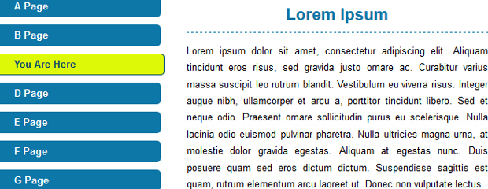

In this post I describe how the logic needed to add a CSS current marker to a webpage can be achieved very simply with very little logic on the website's server. I look at why a current page marker is important and why we need to use them.

<!--more-->

## Good User Centered Design

When a website user sees a distinctly marked menu item he/she is instantly orientated to where within the website they are in terms of the website structure. Without a distinct marking a user cannot easily determine where they are within the website. A lack of marking leads to avoidable extra cognitive work on the user's part.



In providing a good user experience the burden of identifying where a user is, should be the concern of the website itself. Using CSS, the information can be conveyed to a normal sighted user with colour. The colour needs to unambiguously highlight the corresponding menu item related to the page the user is currently on.

It's common practice to achieve this by adding a marker via the use of a CSS class within the mark-up. The CSS class may have a name akin to 'current'. The CSS class is added, often server side, to the menu item during the creation of the menu. For example:

```html
<ul id="nav">
    <li class="current"><a href="home">Home</a></li>
    <li><a href="about">About</a></li>
</ul>
```

Then using CSS such as the example below, the item will appear highlighted.

```css
.current a
.current a:link
.current a:visited{
	Background-colour: #ccc;
}
```

## Braking the Rules Elegantly

Here is the problem with adding a 'current' class. During the menu creation you have to get the server to repeat the decision: is this the item to add the class to? Ok, not a big problem and if you have already implemented this logic in old projects, it is probably better to leave it in.

However before you implement this logic into your next project, be aware there is a second way. I had this idea recently looking at this problem for myself for the first time. The solution that dawned uses less logic and not one 'if' statement.

I normally would say 'no way' to using a style attribute directly in a web page's source because it breaks the rule of separation. Sometimes, however, breaking the rules can lead to a very elegant solutions. Elegant in this case because of a large reduction in the logic is removed from the menuing process.

### How to Reduce the Logic 

First, give a unique name to each page. Then simply use the unique name as a CSS class on every menu item.

```html
<ul id="nav">
    <li class="home-page"><a href="home">Home</a></li>
    <li class="about-page"><a href="about">About</a></li>
</ul>
```

Second, output the name of the current page, as a CSS class, in the head element of the page's HTML each time the page is dispatched. Here is an example of how this may look using EL in JSP:

```html
<style>
.${page.clsss} a
.${page.clsss} a:link
.${page.clsss} a:visited{
	Background-colour: #ccc;
}
</style>
```

Then, using the homepage as an example, the output would look like this:

```html
<style>
.home-page a
.home-page a:link
.home-page a:visited{
	Background-colour: #ccc;
}
</style>
```

The CSS would then highlight the homepage as the current page. As soon as the user moves to another page, the class name within the style tag will change to reflect the name of the next current page.

This also means that the menu can be created and cached once for every time the menu is edited.