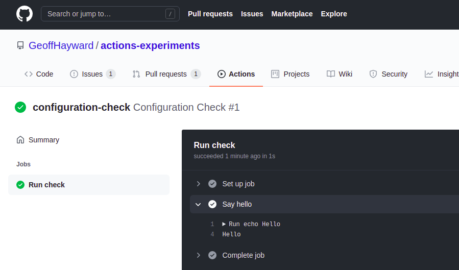

In this post I am going to show how you can trigger a [GitHub Actions](https://github.com/features/actions) workflow
with a Slack Slash command.

<!--more-->

The popular team communication platform 'Slack' provides several means to extend their platform. One means of extension
is the so-called [Slash Command](https://api.slack.com/interactivity/slash-commands#what_are_commands), which as the
name suggest starts with a forward slash. When a Slash Command is invoked, Slack will call the associated Slack App's
webhook. This means you can integrate with any external service, including invoking your own GitHub Actions Workflow.

The very popular Git code hosting platform 'GitHub' has recently added the 'GitHub Actions' capability. GitHub Actions
makes it easy to automate all your software workflows [^1].

The payload send from the Slack Slash command is not understood by GitHub's own API directly. However, with the help of
the [AWS API Gateway](https://aws.amazon.com/api-gateway/) it's possible to integrate a Slack Slash Command with a
GitHub repository dispatch event.

# The GitHub Actions Workflow

For the sake of this post, the GitHub Actions Workflow is kept simple. By keeping it simple we can keep validating our
configurations.

If you would like to follow along, you can fork
my [Actions Experiments](https://github.com/GeoffreyHayward/actions-experiments/) repository.

```yaml
name: Configuration Check
on:
  repository_dispatch:
    types:
      - configuration-check
jobs:
  check:
    name: Run check
    runs-on: ubuntu-latest
    steps:
      - name: Say hello
        run: echo Hello
```

As you can see from my example, GitHub Actions Workflow's that are triggered externally via GitHub's API listens
for [repository dispatch events](https://docs.github.com/en/rest/reference/repos#create-a-repository-dispatch-event).

In order to trigger GitHub Actions Workflow, on a repository you have access to, you must first obtain a **repo**
scoped [Personal Access Token](https://docs.github.com/en/github/authenticating-to-github/creating-a-personal-access-token)
from this URL https://github.com/settings/tokens.


With the token to hand, the GitHub Actions Workflow can be triggered from the terminal with the following curl command
with
`{owner}` replaced respectively.

```shell
curl \
  -X POST \
  -H "Accept: application/vnd.github.v3+json" \
  -H "Authorization: Bearer ********* PERSONAL ACCESS TOKEN *********" \
  https://api.github.com/repos/{owner}/actions-experiments/dispatches \
  -d '{"event_type":"configuration-check"}'
```

The curl command should return with an empty body. You can check if it worked within the GitHub repository's actions
tab. The run should look like this.



# The AWS API Gateway Instance

Once the triggering of the Actions Workflow is verified, it's time to add
the [AWS API Gateway](https://aws.amazon.com/api-gateway/) into the mix. The AWS API Gateway will allow for the
transforming of the payload, that's soon to be sent from Slack into a payload understood by GitHub.

We begin by creating a new AWS API Gateway of type REST API.


Once created, add a resource named 'example'.


Give the resource a method of type POST. Choose the Integration Type as an HTTP integration. This allows you to call out
to non AWS services, such as the GitHub API. Set the Endpoint URL
as `https://api.github.com/repos/{owner}/actions-experiments/dispatches` replacing owner respectively.


At this point, with the example POST method selected, you should see a method execution view that looks akin to the
screen grab bellow.


Within the 'Integration Request' stage of the request add the 'Accept' and 'Authorization' headers.

| Key     | Value |
| ----------- | ----------- |
| Accept    | application/vnd.github.v3+json |
| Authorization   | Bearer ********* PERSONAL ACCESS TOKEN *********|


With everything in place, let's check we can trigger our GitHub Actions Workflow from this AWS API Gateway method. 
Open the test view and set the body to `{"event_type":"configuration-check"}`.


After pressing test, just as with the CURL command, you are looking for a status 200 and empty response body. You can also
check it worked within the GitHub repository's actions tab. There should now see two runs.


We are almost ready to move on to setting up a Slack App, but first we must add a `application/x-www-form-urlencoded` Mapping
Template. Slack sends a `application/x-www-form-urlencoded` payload. The GitHub API, on the other hand, expects an 
`application/json` payload, that include the `event_type` property.  


The last required step, in setting up the AWS API Gateway, is to deploy the API. You will find the 'Deploy API' option 
under 'Actions'.


The first time you deploy and API you will have to set up a Stage. For this post I decided 'API' would be a good name.


To find the full invocation URL for the example POST method, head to the 'api' stage > '/api/example' where you will 
find the full address. This is the address that will be given to the Slack Slash Command. 


With that we are ready to move on to setting up a Slack App, however if you are following along, it's a good idea to set up AWS CloudWatch now, it's not essential, but it will let you soon see 
Slack's payload. If you would like to set up CloudWhat here is
the AWS [documentation](https://aws.amazon.com/premiumsupport/knowledge-center/api-gateway-cloudwatch-logs/) to follow.

# Create a Slack Slash Command

It's now time to set up the Slack Slash Command. In order to create a Slack Slash Command you first need to [create a Slack App](https://api.slack.com/apps?new_app=1).


After creating a Slack App, you can [create a Slash Command](https://api.slack.com/apps/A01KM6562KY/slash-commands). 


As you can see, the command I created for this post is `/configuration-check`. When the command is invoked the 
corresponding webhook is the 'example' POST method on AWS' API Gateway.

Before we can invoke the Slack Slash Command, we must connect it to the respective Slack Workspace. Go to the page named
'OAuth & Permissions' and click 'install to workspace'.


Once the Slack App is installed to the respective Workspace, it will appear under 'Apps' in Slack. 

Without further ado let's check it works by invoking it.


The is no feedback in slack, if the call was successful. Sure enough, the GitHub Actions Workflow ran.


In follow-up posts I will look at verifying the origin of the Slack Slash Command and posting messages back from GitHub.
Until then thanks for reading.


[^1]: https://github.com/features/actions